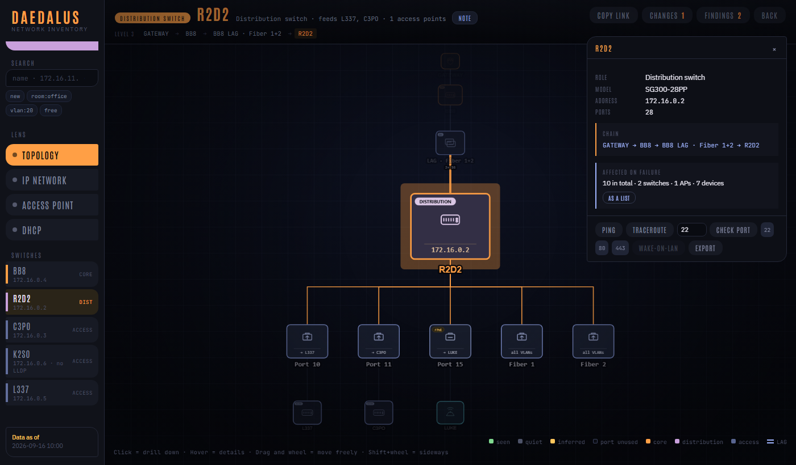
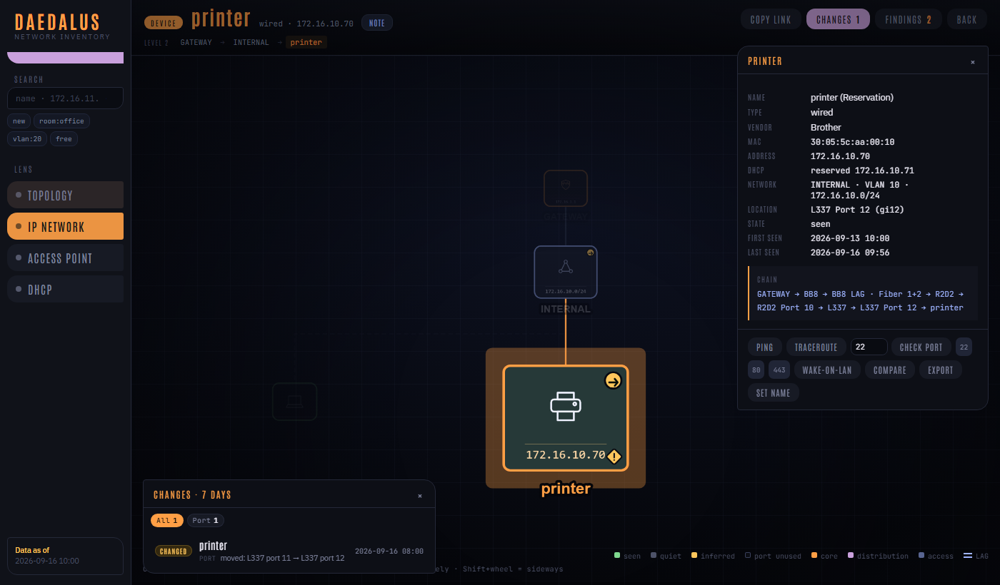
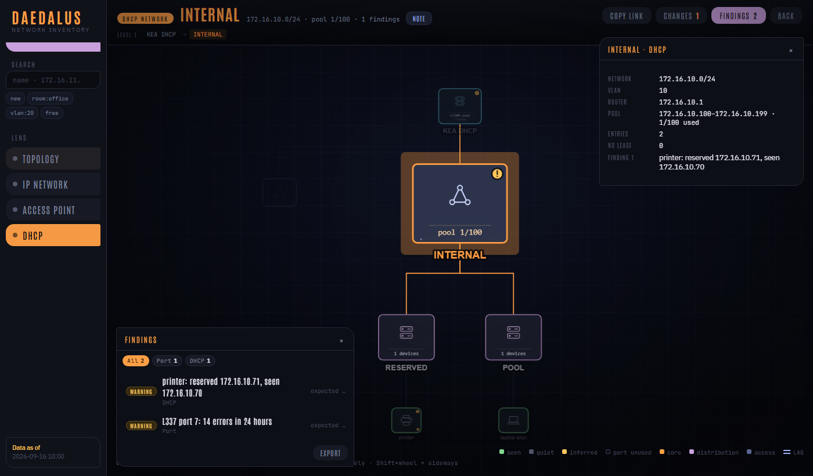

# Daedalus

A small **network inventory with history** for a home lab or small office: which
device is plugged into which switch port, which address it had when, and what
changed - shown as a map you can drill into.

```text
GATEWAY → BB8 → R2D2 port 10 → L337 port 12 → printer   172.16.10.70
```

No agent on the devices, no network tap. Daedalus asks what your network already
knows - over SNMP and a few HTTP APIs - and joins it:

| Source | tells you | useless alone because |
|---|---|---|
| ARP table of the gateway (SNMP) | IP ↔ MAC | knows no port |
| MAC table of each switch (SNMP) | MAC ↔ port | knows no direction |
| LLDP of each switch (SNMP) | port ↔ neighbour port | knows no end devices |
| port state (SNMP) | link, speed, duplex, VLANs, STP, PoE, error counters | - |
| Kea DHCP *(optional)* | names from leases and reservations, pools | - |
| Prometheus *(optional)* | host names of your scrape targets; Wi-Fi clients via [unpoller](https://github.com/unpoller/unpoller) | - |

The web UI has four lenses (topology, IP network, access point, DHCP), a search
with filters (`vlan:20`, `vendor:apple`, `room:office`, `free`), a change log for
the last seven days, **findings** (duplicate addresses, half-up bundles, flapping
ports, reservations that do not match, uplinks in half duplex, …), notes and wall
outlet numbers on any port, device or network, and ping / traceroute / port check /
Wake-on-LAN from the detail card.



| Device card, chain and change log | DHCP lens with findings |
|---|---|
|  |  |

*Screenshots of the demo network from `tools/demo_state.py` - no real data.*

## Contents

- [Quick start](#quick-start)
- [Requirements](#requirements)
- [Deployment](#deployment) - Docker Compose, Nomad, plain Python
- [Configuration](#configuration)
- [Integrating into your setup](#integrating-into-your-setup)
- [How it works](#how-it-works)
- [Development and tests](#development-and-tests)
- [Upgrading and uninstalling](#upgrading-and-uninstalling)

## Quick start

**Look at the UI first, without any hardware** - a made-up network rendered into a
static page:

```bash
python tools/demo_state.py demo.json
python tools/preview.py demo.json preview.html     # open preview.html in a browser
```

**Ask your network once, without a database** (needs `snmpbulkwalk` from net-snmp):

```bash
cp daedalus.example.toml daedalus.toml             # describe your switches and networks
export DAEDALUS_SNMP_FIREWALL=public DAEDALUS_SNMP_SWITCH=public
python run.py --dry
```

`--dry` queries every source, keeps everything in memory and prints what it found,
including the LLDP neighbourhood. That is the fastest way to see whether your
hardware speaks what Daedalus expects.

**Run it for real** with Docker Compose (brings its own PostgreSQL):

```bash
cp .env.example .env                               # passwords, SNMP communities
cp daedalus.example.toml daedalus.toml             # your network
docker compose -f deploy/docker-compose.yml --env-file .env up -d --build
```

Open <http://localhost:8000>. The first collection run marks everything as existing
inventory; from the second run on you see changes.

## Requirements

- **Python 3.12+** (or just Docker). Python packages: `psycopg[binary]`, `fastapi`,
  `uvicorn` - the `Dockerfile` pins tested versions.
- **PostgreSQL 14+**. Daedalus keeps everything in its own schema `daedalus` and
  creates it on first start.
- **net-snmp** (`snmpbulkwalk`) where the collector runs - included in the image.
- **Network access** from the collector to the gateway and every switch on UDP 161.
- On the **switches**: SNMP v2c read access and LLDP enabled. Used MIBs: IF-MIB,
  BRIDGE-MIB, Q-BRIDGE-MIB (`dot1qTpFdbPort`, VLAN tables), LLDP-MIB,
  EtherLike-MIB, POWER-ETHERNET-MIB.
- On the **gateway/firewall**: SNMP v2c read access to the ARP table
  (`ipNetToMediaPhysAddress`).

Developed and tested against Cisco SMB switches (SG200/SG300), a Sophos firewall,
Kea DHCP in an HA pair and UniFi via unpoller. Standard MIBs are used wherever they
exist; the one vendor-specific OID is the per-port PoE power of Cisco SMB switches
(`collector_portstate.py`) - on other switches that value is simply missing. If a
switch reports its MAC table or LLDP differently, `python run.py --dry --only lldp`
shows it quickly; the parsers live in `daedalus/collector_*.py` and each has tests
with real (pseudonymised) captures under `tests/samples/`.

## Deployment

One image, two processes:

| Process | Command | Does |
|---|---|---|
| collector | `python run.py --service` | collects every source at its own pace, creates the schema, applies migrations |
| web UI | `uvicorn daedalus.web:app --host 0.0.0.0 --port 8000` | serves the map and the API, only reads (plus notes) |

Run **exactly one** collector. The web UI can run as often as you like.

### Docker Compose

[`deploy/docker-compose.yml`](deploy/docker-compose.yml) runs PostgreSQL, the
collector and the UI. It mounts `./daedalus.toml` into both containers and reads
secrets from `.env`. To use an existing PostgreSQL instead, delete the `db` service
and set `DAEDALUS_DSN` in the `environment` block.

The collector needs to reach your switches. With Docker's default bridge network
that works as long as the host can route there. For **Wake-on-LAN** broadcasts to
reach the right network, run the `web` container with `network_mode: host`.

### Nomad

[`deploy/nomad/daedalus.nomad.hcl`](deploy/nomad/daedalus.nomad.hcl) is a complete
job: one group with a collector and a web task, secrets from Nomad Variables, the
site configuration rendered into the shared alloc directory, a health check on
`/ready` and Traefik tags. Build and push the image first:

```bash
docker build -t registry.example.com/daedalus:1.0.0 .
docker push registry.example.com/daedalus:1.0.0
nomad var put nomad/jobs/daedalus dsn='postgresql://…' snmp_firewall='…' snmp_switch='…'
nomad job run deploy/nomad/daedalus.nomad.hcl
```

### Plain Python / systemd

```bash
pip install "psycopg[binary]" fastapi uvicorn
export DAEDALUS_DSN=postgresql://daedalus:…@localhost:5432/daedalus
export DAEDALUS_SNMP_FIREWALL=… DAEDALUS_SNMP_SWITCH=… DAEDALUS_CONFIG=/etc/daedalus.toml
python run.py --service &                            # collector
uvicorn daedalus.web:app --host 127.0.0.1 --port 8000  # web UI
```

For systemd, create one unit per process with these commands and put the variables
into an `EnvironmentFile=` readable only by the service user.

### Database

Any PostgreSQL will do; create a database and a role that owns it:

```sql
CREATE ROLE daedalus LOGIN PASSWORD '…';
CREATE DATABASE daedalus OWNER daedalus;
```

The collector creates the schema on first start. Behind **PgBouncer** keep the
connection string as it is: Daedalus sets `TimeZone` and `search_path` as startup
parameters itself, because PgBouncer does not pass on database-level settings.

## Configuration

Two places, deliberately separate:

| What | Where |
|---|---|
| the site - gateway, switches, networks, Kea, Prometheus, time zone, allowed actions | `daedalus.toml` ([example](daedalus.example.toml)), path via `DAEDALUS_CONFIG` |
| secrets and switches | environment variables ([example](.env.example)) |

Environment variables:

| Variable | Used by | Meaning |
|---|---|---|
| `DAEDALUS_DSN` | collector, web | PostgreSQL connection string (required for anything but `--dry`) |
| `DAEDALUS_SNMP_FIREWALL` | collector | SNMP community of the gateway; without it no ARP collection |
| `DAEDALUS_SNMP_SWITCH` | collector | SNMP community of the switches; without it no switch collection |
| `DAEDALUS_CONFIG` | collector, web | path of `daedalus.toml` (default `./daedalus.toml`) |
| `DAEDALUS_SCAN_ENABLED` | web | `yes` shows the port scan button (nmap connect scan, top 100 ports). Off by default: many firewalls block a host that scans. |
| `DAEDALUS_SNMP_VIA` | collector | development only: run SNMP on this host over SSH |
| `DAEDALUS_TEST_DSN` | tests | database for the test suite - its name must end in `_test`, it gets emptied |

What the configuration describes that no source can deliver:

- **networks** - CIDR, VLAN and your name for it (`SERVER`, `GUEST`, …). Devices are
  sorted into them by address; anything else lands in *OTHER*.
- **switches** - name, management address, model, number of front ports. The name
  must match what the neighbours report via LLDP (case does not matter).
- **root_switch** - the switch directly behind the gateway; the map starts there.
- **actions.own_networks** - the only networks ping, traceroute, port check and
  Wake-on-LAN may target. `ping_only_networks` allow ping and nothing else.
- **intervals** - how often each source is asked. The defaults follow how fast the
  data ages (ARP and MAC tables every 5 minutes, LLDP every 30).

## Integrating into your setup

**Authentication.** The UI has **no login of its own**. Put it behind a reverse
proxy with authentication (oauth2-proxy, Authelia, Traefik forward-auth, …).
Notes are stored with the name from `X-Forwarded-Preferred-Username` or
`X-Forwarded-User` if your proxy sets them - so only let the proxy reach the UI.

**Reverse proxy.** The UI is a single page plus a JSON API under `/api/`; it works
under its own host name (`daedalus.example.com`). `/health` answers without a
database (liveness), `/ready` checks the database (readiness).

**Monitoring.** The collector logs one line per change and per failing source to
stdout; nothing is logged while nothing changes. Point your log shipping at it, or
alert on `/ready`.

**Backups.** Everything lives in the schema `daedalus` of your database - include it
in your normal PostgreSQL backup. The only data that cannot be collected again are
the notes (table `annotation`).

**Your data in other tools.** `GET /api/state` returns the complete current state as
JSON (the same the UI renders); `GET /api/object/<mac or switch:port>` returns the
chain, the history and "who was plugged in here". Findings and switch port tables
can be exported as Markdown from the UI.

## How it works

Four rules, each backed by tests:

1. **Intervals, not snapshots.** A state that stays the same keeps its interval
   open; storage grows with *changes*, not with *time*.
2. **Absence ends an interval only if the responsible source succeeded.** A switch
   that did not answer must not make 50 devices "disappear".
3. **Only the responsible source may judge.** The DHCP collector cannot end a port
   attachment just because it does not see ports.
4. **Imports are idempotent**, and the first run of any (new) source marks
   everything as existing inventory, not as "new".

A few details worth knowing:

- **Access port or uplink.** A MAC on an access port is plugged in there; a MAC on
  an uplink is somewhere further down. A port counts as an uplink if it has an LLDP
  neighbour or is a port channel (`Po1`) - the MAC table names the channel, LLDP its
  members.
- **Randomised MACs** (phones) are tracked, but their appearing and disappearing is
  not reported - otherwise the change log would consist of nothing else.
- **Cheap pre-checks** before expensive walks (`ifLastChange`, grouped Prometheus
  counts), and a disappearance only counts after it was seen twice.
- **UTC inside, local time outside.** Stored and computed in UTC, displayed in the
  configured zone - in the night the clocks go back, 02:30 exists twice locally.

| Path | What |
|---|---|
| `daedalus/reconcile.py` | the rules above - the only place that decides new / moved / gone |
| `daedalus/collector_*.py` | ARP, switch MAC table + LLDP, port state, Kea, Prometheus |
| `daedalus/store.py` | the store interface, in memory and PostgreSQL |
| `daedalus/chain.py` | "from where to where" - the port chain |
| `daedalus/service.py` | scheduler: every source at its own pace, staggered, with back-off |
| `daedalus/state.py` | builds what the map shows, and the findings |
| `daedalus/web.py`, `daedalus/web/index.html` | FastAPI and the single-page UI |
| `schema.sql`, `migrations/` | database schema and later migrations |
| `run.py` | run once, as a service, or dry |
| `tools/` | demo state and static preview |

## Development and tests

```bash
pip install "psycopg[binary]" fastapi uvicorn httpx pytest
python -m pytest -q
```

Every rule test runs twice: in memory and against a real PostgreSQL. Without
`DAEDALUS_TEST_DSN` the database pass is skipped. With it:

```bash
DAEDALUS_TEST_DSN=postgresql://daedalus:…@localhost:5432/daedalus_test python -m pytest -q
```

> **The tests empty that database.** They read `DAEDALUS_TEST_DSN`, not
> `DAEDALUS_DSN`, **and** refuse to run unless the database name ends in `_test`.

The captures under `tests/samples/` are real SNMP, Kea and UniFi responses,
pseudonymised before publication: addresses moved to `172.16.0.0/16`, MACs and
names replaced by stable pseudonyms. Structure and edge cases are kept.

## Upgrading and uninstalling

**Upgrading:** build or pull the new image and restart the collector first - it
applies new migrations on start (each file once, guarded by an advisory lock).
Then restart the web UI. Your `daedalus.toml` and the database stay as they are.

**Uninstalling:** stop both processes and drop the schema:

```sql
DROP SCHEMA daedalus CASCADE;
```

Nothing is installed on switches, gateway or clients - Daedalus only reads.

## License

[MIT](LICENSE)
